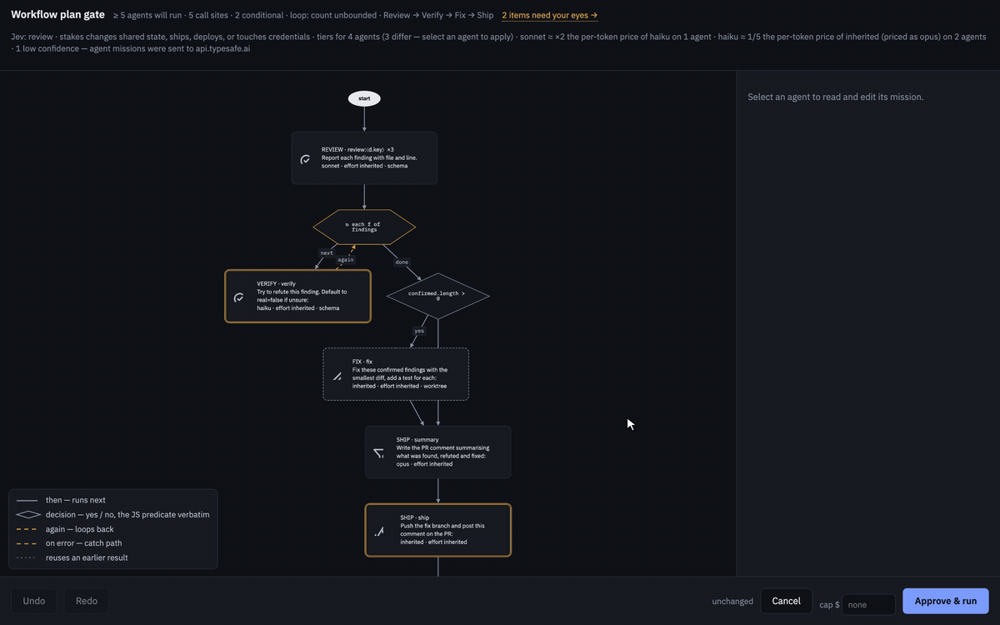

<div align="center">


# workflow-gate

**A human approves the exact script before a Claude Code `Workflow` runs.<br>Then they can see what it will cost, what it touches, and watch it run.**

[](plugin/.claude-plugin/plugin.json)
[](#install)
[](plugin/hooks)
[](plugin/hooks)
[](LICENSE)


</div>

Claude Code's `Workflow` tool can fan one call out into dozens of sub-agents: `pipeline()`, `parallel()`, loops, model tiers, worktrees. `workflow-gate` puts a barrier in front of that call. The barrier lifts for **one script, byte for byte**, once a human has looked at it.

```
/plugin marketplace add VictorGjn/workflow-gate
/plugin install workflow-gate@victorgjn
```

That is the whole install. The gate, the graph editor, the history viewer and the `workflow-orchestration-patterns` skill are active in your next session.

---

## How it works

<div align="center">

</div>

1. **Claude calls `Workflow`.** A `PreToolUse` hook stops the call before a single agent starts.
2. **A graph editor opens in your browser** and the hook waits for your click. The script is drawn as a flowchart: one node per `agent()` call site, diamonds for conditions, hexagons for loops, `×N` on fan-outs.
3. **You approve that exact content.** The approval is keyed to `SHA-256(script + plugin version)`. Edit one character and the gate fires again.
4. **The same tab becomes the live view** of the run you just approved: agents lighting up, spend climbing, last tool called.

## The real editor

<div align="center">

<br><sub>Recorded from the plugin itself on a sample <code>review-and-fix-pr</code> script. Nothing is mocked.</sub>
</div>

In twenty seconds, the reviewer:

- follows **"2 items need your eyes"**: an agent inside a loop with no bound, and one whose mission pushes to a remote;
- opens the `verify` agent, reads its full mission and where each `⟨interpolation⟩` comes from;
- **applies a model-tier suggestion** with one click. The edit is spliced into the original bytes, so everything else stays identical;
- sets a **spend cap** of $4.50, with alerts at 80% and 100%;
- clicks **Approve & run**. That call goes through, and nothing else.

<details>
<summary><b>No browser? What Claude reads instead</b></summary>

With `WORKFLOW_GATE_NO_UI=1`, or when nobody touches the editor for 90 s, Claude gets the gate's decision in text and has to take it back to you:

```text
⛔ Workflow plan-gate — no recorded human approval for this exact script.
This is a hard decision (which workflow shape is right, and does the cost match the task) — resolve it with a human before this call runs:

1) Enter Plan Mode. Propose the recommended workflow design, PLUS 1-2 real alternatives …
2) Get the user's explicit choice (ExitPlanMode approval, or a direct answer in chat).
3) Record the approved plan (this lifts the gate)
4) Retry the Workflow call — same script content.

Static estimate for the script as submitted (call-site counts, not runtime counts):
  name: review-and-fix-pr
  phases: Review → Verify → Fix → Ship
  agent() call sites: 5 — ⚠ AGENTS ACTUALLY LAUNCHED IS HIGHER: a parallel()/pipeline() fans out over a runtime list
  isolation:'worktree': yes   schema outputs used: yes
  ⚠ a runtime-sized fan-out may run on the top tier: the list size multiplies the most expensive rate.
```

</details>

## What you get

| When | What | Why it matters |
|---|---|---|
| **Before the run** | `≥ N agents will run`, a static lower bound checked against every recorded run | The number you approve is never an over-promise |
| | **Diff against your last approval** of the same script | Re-runs with small edits don't mean re-reading everything |
| | **Needs your eyes**: unbounded loops, top-tier fan-outs, missions that push, deploy or delete | Your attention goes where the risk is |
| | **Past spend** of this workflow (median / p75 / max, with `n` and dates) | A dollar figure before you click, from runs that actually happened |
| | Optional **model-tier advice** from [Jev](https://docs.typesafe.ai) with a price delta; stricter when the stakes are high | Cheaper tiers where a mission is mechanical. Advice only |
| **During the run** | Live graph: per-node state, `k/N done`, spend so far, spend cap alerts | "Already $180 at minute twenty" arrives while you can still stop it |
| **After the run** | History of every run on the machine, **priced from real token usage** (each message counted once) | Cost is measured, not estimated |
| | Opt-in outcome check: did each agent actually deliver? | Cheap failures stop looking like cheap successes |

## Only you can lift it

The gate protects one promise: **a human approved this exact script.** Version 1.8 closes the ways text could stand in for that human.

- **The override is yours alone.** Send "override manual approval" (optionally "for 2h") as its own message to lift the gate for the session; "restore manual approval" puts it back. It only counts as your own message or its first line.
- **Injected text never counts.** Task notifications, system reminders and pasted tool output never lift the gate, even when they quote the phrase. A real run of this project found that bug: a workflow result quoted the phrase as a test case and the gate turned itself off. It is fixed and covered by a selftest.
- **Negations never count.** "Never override manual approval" and "no need to override, I'll click approve" leave the gate on.
- **Scheduled prompts never count.** `CronCreate` and `ScheduleWakeup` prompts carrying the phrase are refused.
- **Fails open on its own bugs, never on a missing decision.** An internal error steps aside instead of wedging your session. A closed tab, a timeout or silence is a *no*.

## Cost and capability governance

The bundled `workflow-orchestration-patterns` skill teaches Claude to design the workflow so that cost and access are decided, not defaulted.

| Tier | Use for | Never for |
|---|---|---|
| **Haiku** | Small, mechanical, narrowly scoped units: applying an accepted fix, one item of a fan-out | Judging its own output |
| **Sonnet** (default) | Most builds, most reviews, most single `agent()` calls | — |
| **Opus** | Large-context synthesis, a hard verification pass, a decision with consequences | Routine work a cheaper tier does as well |
| **Advisor** (Opus) | Planning the decomposition, a terse check before something ships | Bulk execution |

Tiering pays off only when it narrows the **scope** of each agent. A cheaper model name on an identically sized task still pays the same context and reading overhead.

<details>
<summary><b>Capability-aware agents and capability escalation</b></summary>

Skills and MCP tools are not automatic inside a `Workflow`: an agent reaches for one only if it has access **and** its prompt gives it a reason to. The skill names the capability explicitly and gives the agent a type that has it:

```js
const built = await agent(
  `Load the frontend-conventions skill via the Skill tool, then implement the login form per: ${spec}`,
  { label: 'build:frontend', phase: 'Build', model: 'haiku', agentType: 'general-purpose', schema: BUILD_SCHEMA }
)
```

When a worker discovers mid-run that it needs something it was not granted, it **reports** instead of working around it. An advisor-tier agent judges the request by consequence, and only real risk reaches a human:

```js
if (result.capabilityRequest) {
  const judged = await agent(
    `Worker requested "${result.capabilityRequest.name}" because: ${result.capabilityRequest.reason}. ` +
    `Destructive, externally visible, or credential-touching → escalate_to_human. Otherwise → auto_allow.`,
    { model: 'opus', schema: ADVISOR_SCHEMA }
  )
  if (judged.decision === 'escalate_to_human')
    return { status: 'needs_human_decision', request: result.capabilityRequest, rationale: judged.rationale }
}
```

Auto-allow is capped at two rounds, then escalates anyway: repeated capability creep in one phase is itself worth a human's attention. The grant list is an **instruction**, not a sandbox. For untrusted input, use a custom `agentType` with a narrower toolset.

</details>

## Where it fits

| | Content-pinned approval | Visual review of the graph | Measured cost | Model-tier guidance | Capability escalation |
|---|:---:|:---:|:---:|:---:|:---:|
| **workflow-gate** | ✅ SHA-256, re-gates on edit | ✅ flowchart, diff, live run | ✅ from token usage | ✅ skill + Jev advice | ✅ advisor-judged |
| Claude Code's built-in prompt | ⚠️ bypassable by permission mode | ❌ | ❌ | ❌ | ❌ |
| Generic guardrail hooks | ⚠️ broad Bash/Write blocking | ❌ | ❌ | ❌ | ❌ |

## Configuration

| Variable | Effect |
|---|---|
| `WORKFLOW_GATE_OFF=1` | Kill switch: the gate steps aside entirely |
| `WORKFLOW_GATE_NO_UI=1` | No browser; the text flow above everywhere |
| `TYPESAFE_API_KEY` | Enables Jev's intent and model-tier advice in the editor. Only the extracted skeleton (name, phases, one mission per agent) leaves the machine |
| `WORKFLOW_GATE_OUTCOME=1` | With the key: after each run, Jev checks whether each agent delivered. Opt-in, results truncated to 1.5 KB |

`node plugin/hooks/workflow-plan-gate.mjs history` opens the history viewer. Full technical documentation: [`plugin/README.md`](plugin/README.md).

## Honest limitations

> **The gate defends against accidental and expensive launches, not against an adversarial agent.** An agent with a shell can still run the plugin's own `override` command or write its state file. The v1.8 hardening stops *text* from being credited to you; it does not sandbox a determined agent. Likewise, a capability grant list is an instruction, not an enforced boundary.

- Cost figures use Anthropic first-party API rates. On a subscription, that is the API-equivalent cost, not your bill.
- Jev advice is advice. It never approves, denies or applies anything on its own, and low-confidence answers are shown as such.
- The editor loads acorn, cytoscape and dagre from public CDNs. Offline it cannot start, and the text flow in chat takes over.

## License

MIT © [VictorGjn](https://github.com/VictorGjn). Issues and PRs welcome.

<sub>Hero animation generated with Higgsfield (GPT Image 2.5 → Seedance 2.5). Diagram, logo and editor recording made from the plugin's own code.</sub>
